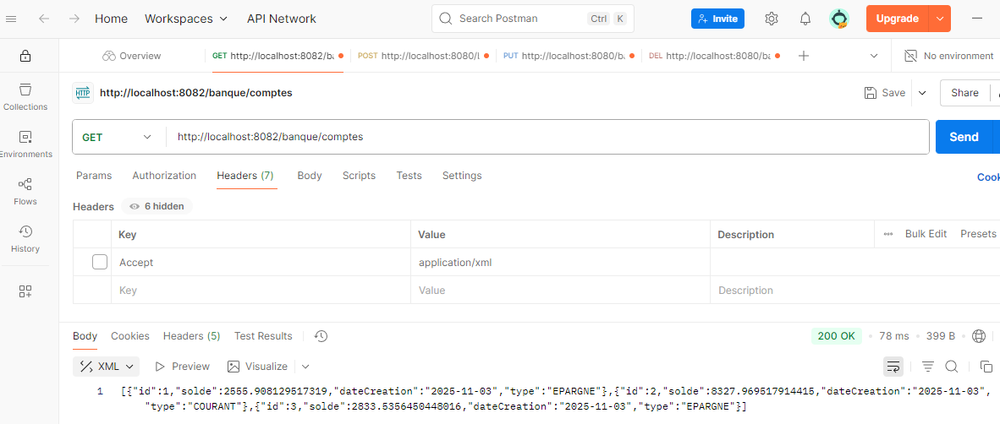

# Architecture des microservices - TP 7


---
## Console H2

<div style="border: 2px solid #333; padding: 10px; display: flex; gap: 10px; max-width: fit-content;">

  
  

</div>

## JSON sur SoapUI

<div style="border: 2px solid #333; padding: 10px; max-width: fit-content;">
  
</div>

## XML sur Postman

<div style="border: 2px solid #333; padding: 10px; max-width: fit-content;">
  
</div>

## Description

 TP réalisé avec **Spring Boot** intégrant :

- Spring Web pour exposer des API REST
- Spring Data JPA pour la gestion des données
- Base de données H2 en mémoire pour simplifier le développement
- Jersey pour intégrer JAX-RS
- Lombok pour générer automatiquement getters/setters, etc.

---

## Prérequis

- Java 25
- Maven 3.x

---

## Installation et exécution

### Lancer avec Maven

```bash
mvn clean spring-boot:run
